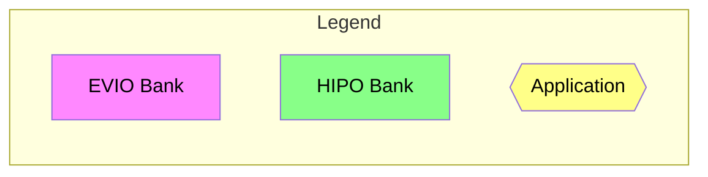
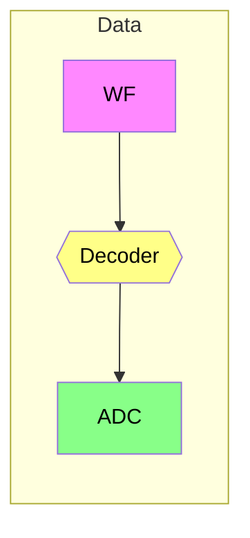
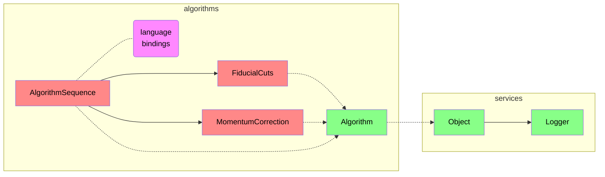

# clas12-wf

# clas12-wf

```mermaid
flowchart LR
    classDef hipo fill:#88ff88,color:black
    classDef evio fill:#ff88ff,color:black
    classDef app fill:#ffff88,color:black
    subgraph Legend
        a[EVIO Bank]:::evio
        b[HIPO Bank]:::hipo
        c{{Application}}:::app
    end
```
# Currently in CLAS12

```mermaid
flowchart LR
    classDef hipo fill:#88ff88,color:black
    classDef evio fill:#ff88ff,color:black
    classDef app fill:#ffff88,color:black
    subgraph Data
        a[WF]:::evio
        b{{Decoder}}:::app
        c[ADC]:::hipo
    end
    a --> b
    b --> c
```

```mermaid
flowchart LR
    classDef cls fill:#88ff88,color:black
    classDef algo fill:#ff8888,color:black
    classDef other fill:#ff88ff,color:black

    subgraph services
        Logger:::cls
        Object:::cls
    end

    subgraph algorithms
        Algorithm:::cls
        FiducialCuts:::algo
        MomentumCorrection:::algo
        AlgorithmSequence:::algo
        bindings(language<br />bindings):::other
    end

    FiducialCuts       -.-> Algorithm
    MomentumCorrection -.-> Algorithm
    AlgorithmSequence  -.-> Algorithm
    Algorithm          -.-> Object

    Object            ---> Logger
    AlgorithmSequence ---> MomentumCorrection
    AlgorithmSequence ---> FiducialCuts

    AlgorithmSequence -.-  bindings

```
